# CS6643 Project 1: Canny Edge Detection
## Install
```bash
python -m pip install -r requirements.txt
```

## Run
Modify the path of the input image in the file `CannyEdgeDetect.py` and run the following command. Default input image is `Barbara.bmp` in `inputs` folder.
```bash
python CannyEdgeDetect.py
```

## Results
<!-- put 3 images in a row with footnote-->

For all three test images, the results after applying 7x7 Gaussian filter, normalized magnitude images, normalized magnitude image after non-maximasuppression, the histograms of the normalized magnitude image after non-maxima suppression are shown below, respectively.
<!-- Put the original image in a row with text on the right and the result of Gaussian filter in another row. -->
Original images: Barbara, Goldhill, Peppers.

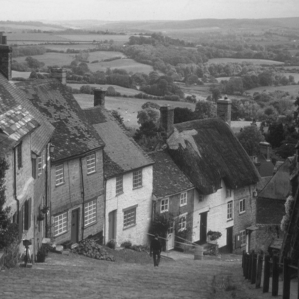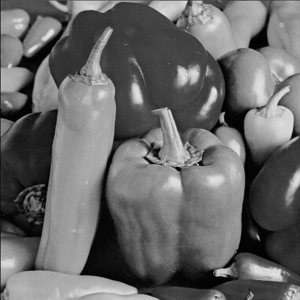

\
Results of Gaussian filter: Barbara, Goldhill, Peppers.


\
Normalized magnitude images: Barbara, Goldhill, Peppers.

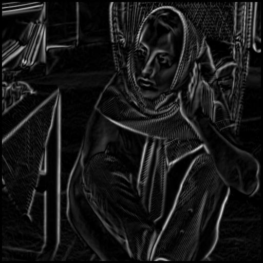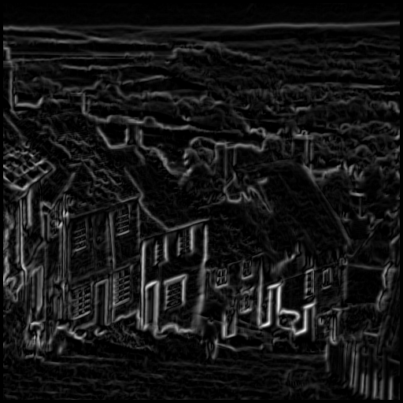

\
Normalized magnitude image after non-maxima suppression: Barbara, Goldhill, Peppers.

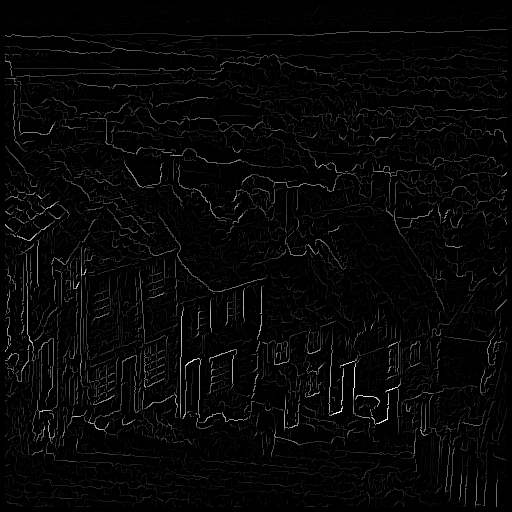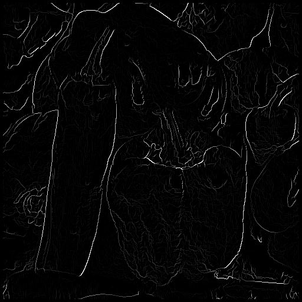

\
Histograms of the normalized magnitude image after non-maxima suppression: Barbara, Goldhill, Peppers.

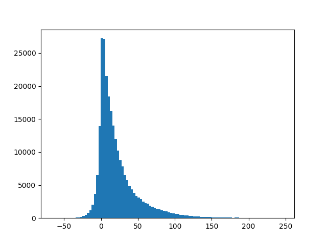


<!--  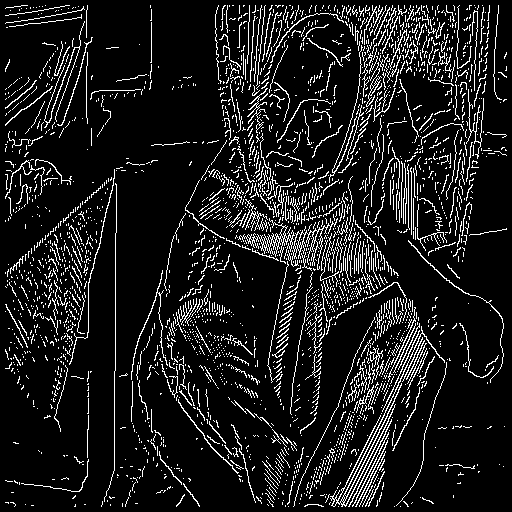  -->

For the image `Barbara.bmp`, the edge maps with thresholds 0.25, 0.5, 0.75 are shown below, respectively.

\
For the image `Goldhill.bmp`, the edge maps with thresholds 0.25, 0.5, 0.75 are shown below, respectively.
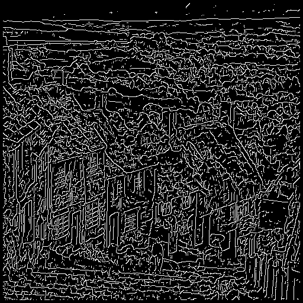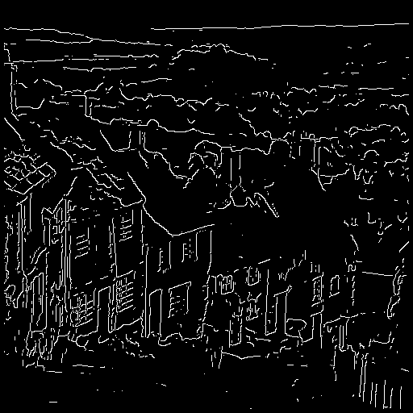
\
For the image `Peppers.bmp`, the edge maps with thresholds 0.25, 0.5, 0.75 are shown below, respectively.
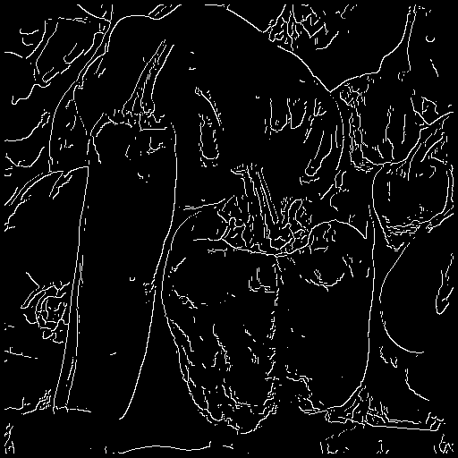


All corresponding results can be found in the folder `results`.
\
All codes are available in the repository https://github.com/JiangZehua/Canny_Edge_Detector

code:

'''
Canny Edge Detection
'''
import os
import cv2
import numpy as np
from matplotlib import pyplot as plt

from pdb import set_trace as TT


G_0 = np.array(
    [[-1, 0 , 1],
     [-2, 0 , 2],
     [-1, 0 , 1]])

G_1 = np.array(
    [[0, 1, 2],
     [-1, 0, 1],
     [-2, -1, 0]])

G_2 = np.array(
    [[1, 2, 1],
     [0, 0, 0],
     [-1, -2, -1]])

G_3 = np.array(
    [[2, 1, 0],
     [1, 0, -1],
     [0, -1, -2]])

# 7x7 Gaussian Mask
Gaussian_mask = np.array(
    [[1, 1, 2, 2, 2, 1, 1],
     [1, 2, 2, 4, 2, 2, 1],
     [2, 2, 4, 8, 4, 2, 2],
     [2, 4, 8, 16, 8, 4, 2],
     [2, 2, 4, 8, 4, 2, 2],
     [1, 2, 2, 4, 2, 2, 1],
     [1, 1, 2, 2, 2, 1, 1]])


def convolution(img, mask):
    '''
    Convolution Operation
    '''
    # create a zero matrix to store the result
    result = np.zeros((img.shape[0]-mask.shape[0]+1, img.shape[1]-mask.shape[1]+1))
    
    # convolution operation
    for i in range(img.shape[0]-mask.shape[0]+1):
        for j in range(img.shape[1]-mask.shape[1]+1):
            result[i,j] = np.sum(img[i:i+mask.shape[0], 
                                     j:j+mask.shape[1]] * mask)
    
    # normalize the result using the sum of the mask (140 for Gaussian mask) if necessary
    norm = 1 / (np.sum(np.concatenate(mask))) if np.sum(np.concatenate(mask)) != 0 else 1

    # # padding the result with zeros so that the size of the result is the same as the original image
    # result = np.pad(result, ((mask.shape[0]//2, mask.shape[0]//2), (mask.shape[1]//2, mask.shape[1]//2)), 'constant', constant_values=0)
    
    return norm * result # return the normalized result


def Gradient_Operation(img, g_0, g_1, g_2, g_3):
    '''
    Calculate the gradient magnitude and direction of each pixel using each for filter, and take the maximum value of the response
    '''
    mask_shape = g_0.shape
    # create a zero matrix to store the result
    result = -10000 * np.ones((img.shape[0] - mask_shape[0] + 1, 
                       img.shape[1] - mask_shape[1] + 1),)
    # result = -1000 * np.ones((img.shape)) # with padding
    index = - np.ones((img.shape[0] - mask_shape[0] + 1,
                        img.shape[1] - mask_shape[1] + 1))
    # index = - np.ones((img.shape)) # with padding

    for i, g in enumerate([g_0, g_1, g_2, g_3]):
        compare = convolution(img, g) 
        index = np.where(compare > result, i, index) # index of the maximum value of the response
        result = np.maximum(result, compare) # maximum value of the response

    # calculate the gradient direction
    direction = np.zeros((img.shape[0] - mask_shape[0] + 1,
                        img.shape[1] - mask_shape[1] + 1))
    # direction = np.zeros((img.shape)) # with padding
    direction[index == 0] = 0
    direction[index == 1] = 45
    direction[index == 2] = 90
    direction[index == 3] = 135

    return result, direction


def Non_Max_Suppression(respond, direction):
    '''
    Non-Maximum Suppression
    '''
    m, n = respond.shape
    result = np.zeros((m-2,n-2))
    
    for i in range(1,m-1):
        for j in range(1,n-1):
            # angle 0
            if direction[i,j] == 0:
                if respond[i,j] >= respond[i,j-1] and respond[i,j] >= respond[i,j+1]:
                    result[i-1,j-1] = respond[i,j]
                else:
                    result[i-1,j-1] = 0

            # angle 45
            elif direction[i,j] == 45:
                if respond[i,j] >= respond[i-1,j+1] and respond[i,j] >= respond[i+1,j-1]:
                    result[i-1,j-1] = respond[i,j]
                else:
                    result[i-1,j-1] = 0

            # angle 90
            elif direction[i,j] == 90:
                if respond[i,j] >= respond[i-1,j] and respond[i,j] >= respond[i+1,j]:
                    result[i-1,j-1] = respond[i,j]
                else:
                    result[i-1,j-1] = 0

            # angle 135
            elif direction[i,j] == 135:
                if respond[i,j] >= respond[i-1,j-1] and respond[i,j] >= respond[i+1,j+1]:
                    result[i-1,j-1] = respond[i,j]
                else:
                    result[i-1,j-1] = 0

    # # padding the result with zeros so that the size of the result is the same as the original image
    # result = np.pad(result, ((1, 1), (1, 1)), 'constant', constant_values=0)
    return result


def simple_threshold(img, threshold):
    '''
    Simple Threshold using 25%, 50%, 75% of the maximum value of the response
    '''
    # threshold = threshold * np.max(img)

    # get the list of image values, and sort them in acsending order
    img_list = np.sort(img.flatten())
    # and fliter out the zeros in the list
    img_list = np.array([i for i in img_list if i != 0])
    # get the index of the threshold value
    index = int(threshold * img_list.shape[0])
    # get the threshold value
    threshold = img_list[index]
    # create a zero matrix to store the result
    result = np.zeros(img.shape)
    result[img >= threshold] = 1
    return result
    

def main(img):
    '''
    main function for Canny Edge Detector
    '''
    img = cv2.cvtColor(img, cv2.COLOR_BGR2GRAY) # convert to gray scale (512, 512)

    # Gaussian smoothing
    img = convolution(img, Gaussian_mask)
    # save the result
    # pad the image with zeros so that the size of the result is the same as the original image
    img_ = np.pad(img, ((3, 3), (3, 3)), 'constant', constant_values=0)
    cv2.imwrite("results/Gaussian_smoothing.bmp", img_)

    # Normalized magnitude of the gradient
    respond, direction = Gradient_Operation(img, G_0, G_1, G_2, G_3)
    # pad the image with zeros so that the size of the result is the same as the original image
    respond_ = np.pad(respond, ((4,4), (4,4)), 'constant', constant_values=0)
    cv2.imwrite("results/Normalized_magnitude_of_the_gradient.bmp", respond_)
    # save the histogram of the result
    plt.hist(respond.flatten(), bins=100)
    plt.savefig("results/histogram_of_the_magnitude.png")

    # Non-Maximum Suppression
    suppressed = Non_Max_Suppression(respond, direction)
    suppressed_ = np.pad(suppressed, ((5,5), (5,5)), 'constant', constant_values=0)
    cv2.imwrite("results/Non-Maximum_Suppression.bmp", suppressed_)

    for i in [0.25, 0.5, 0.75]:
        result = simple_threshold(suppressed, i)
        result_ = np.pad(result, ((5,5), (5,5)), 'constant', constant_values=0)
        cv2.imwrite(f"results/binary_edge_map_{i}_threshold.bmp", result_*255)


if __name__ == "__main__":
    image1 = "inputs/Barbara.bmp"
    image2 = "inputs/Goldhill.bmp"
    image3 = "inputs/Peppers.bmp"

    # img = cv2.imread(image1) # image size (512, 512, 3)
    # img = cv2.imread(image2) # image size (512, 512, 3)
    img = cv2.imread(image3) # image size (512, 512, 3)
    main(img)
    
    

work done by Zehua Jiang and Sanyu Feng
